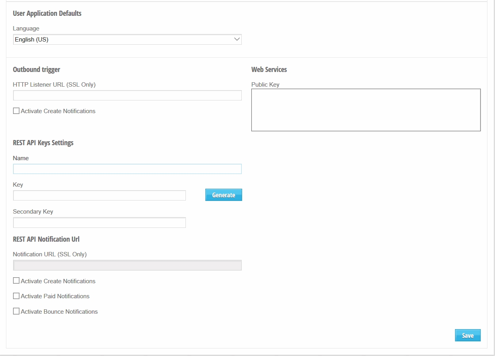

AcceptEasy is a cloudbased service that enables online, mobile and social payments, mandates and verifications. This page details the integration with our Rest API.

For more information regarding our services, check our website: [http://www.accepteasy.com](http://www.accepteasy.com)

For technical support regarding our integrations, please contact [support@acceptemail.com](mailto:support@acceptemail.com)

# [](#rest-api)REST API

The documentation for the API can be found here: [https://api.acceptemail.com/swagger/ui/index#!/Bill/Bill_Get](https://api.acceptemail.com/swagger/ui/index#!/Bill/Bill_Get)

## [](#obtaining-api-keys)Obtaining the API Keys

In order to start developing with our REST API, you will need an API key

Log into the application and select Settings under the Account menu-tab (your account needs Admin or Settings-rights to access this).

At the REST API Keys Settings, enter a name and keys (or let the app generate the keys)


## [Migration from v1 to v2](#migration-v1-to-v2)<a id="migration-v1-to-v2"></a>

The main difference between v1 and v2 of our REST API are that you can now opt for synchronous sending instead of asynchronous sending, and additional data is now set using a standard JSON object instead of through key-value pairs.

### [](#snchronous-vs-asynchronous)Synchronous vs Asynchronous

#### [](#bulk-sending) bulk sending

If you are using our API for bulk sending of emails or text messages, the asynchronous option would still be the most efficient way of sending. You can keep using the asynchrous option by changing your POST endpoint from /v1/Bill to /v2/Bill/async .

#### [](#minline-use-chat-portals) inline use, chat & portals

If you are using our transactions in chats, chatbots, or to redirect users from your portal to our transaction page, it might be more convenient to use our synchronous POST Bill. You can use the same request as /v1/Bill but POST it to /v2/Bill. In this case, instead of just getting the ATID in the response, the response will contain everything you would use GET Bill to get in the asynchronous situation.

### [](#emaildata-to-recorddata) EmailData to RecordData

Instead of using key-value pairs like EmailData in v1, RecordData uses a standard JSON Object. If you are using EmailData in v1, you will have to rename to RecordData and restructure the way the attributes are sent. So:

```
"EmailData": 
[
    {
      "key": "key1",
      "value": "value1"
    },
    {
      "key": "key2",
      "value": "value2"
    }
  ]
```

Will have to change to:

```
"RecordData": 
[
	{
	  "key1": "value1",
	  "key2": "value2"
	}
]
```

# [](#soap-api)SOAP API

We also have a SOAP API available. To obtain the Integration Guide for the SOAP API, please contact us at [support@acceptemail.com](mailto:support@acceptemail.com)